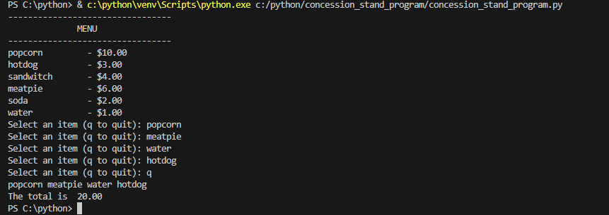

# Concession Stand Program

## Description

    This project shows the list of food items available in a restaurant and there prices and enables the customers to pick the required food items they want available on the menu and add to there cart.

## steps taken to develop this project

1. First step taken is to create the menu showing showing the available food and the price using a dictionary

2. Then display of the menu so that the users can see it and know how to select the food they want.

3. Then in a while loop create an input where the users can add the food tthey want to add to the cart and then calculate the total price of food they picked.

## OUTCOME

